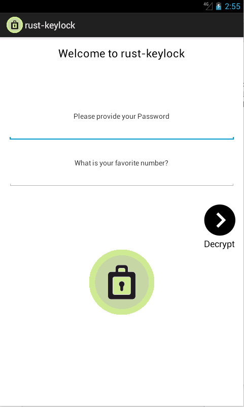
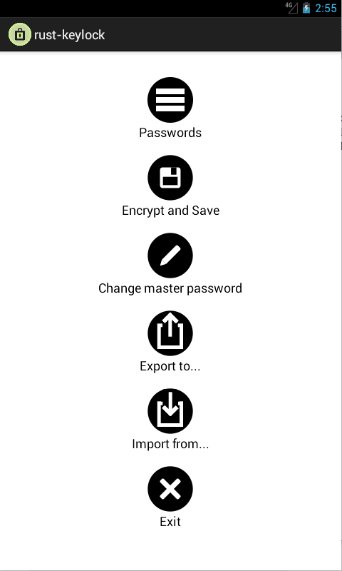
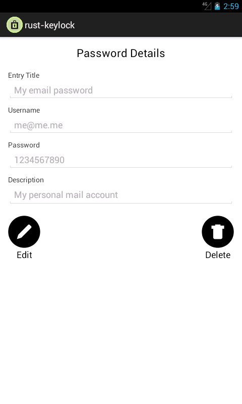

___rust-keylock-android___ is an Android handler of the [rust-keylock-lib](https://github.com/rust-keylock/rust-keylock-lib)

The minimum supported Android API level is __16__ (4.1.2 is tested as a minimum version).

## Screenshots

